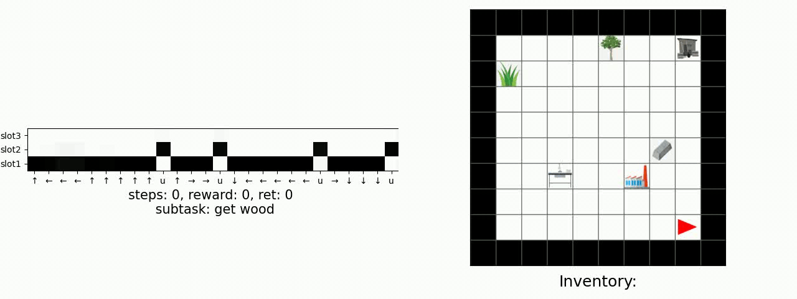
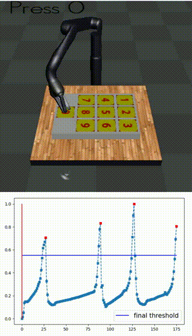
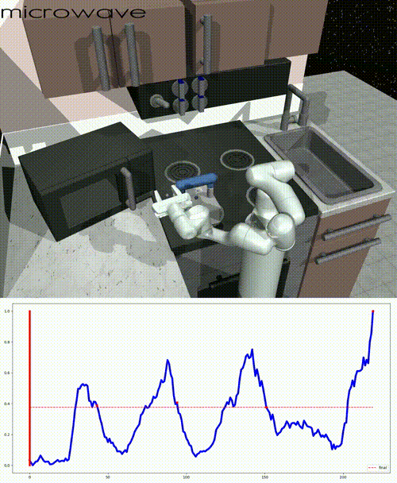

# Abstract
Many complex real-world tasks are composed of several levels of sub-tasks.
Humans leverage these hierarchical structures to accelerate the learning process andachieve better generalization.
In this work, we study the inductive bias and propose Ordered Memory Policy Network (OMPN) to discover subtask hierarchy by learning from demonstration.
The discovered subtask hierarchy could  be  used to perform task decomposition, recovering the subtask boundaries.
Experiments on Craft and Dial demonstrate that our model can achieve higher task decomposition performance under both unsupervised andweakly supervised settings, comparing with strong baselines. OMPN can also be directly applied to partially observable environments and still achieve higher task decomposition performance.
Our visualization further confirms that the subtaskhierarchy can emerge in our model

# Method

# Demo (Craft)

# Demo (Dial)

# Demo (Kitchen)

